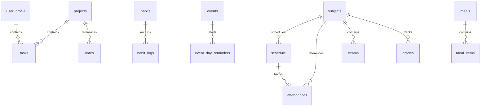

# Lora (Second Brain) — Complete Reference Manual

Welcome to the ultimate technical specification and architectural blueprint for **Lora**. This document serves as the absolute source of truth for the entire Lora ecosystem. It details the runtime stack, modular directory structure, full PostgreSQL database schema, cognitive AI routing pipelines, scheduled routines, keeps-alive, active state machine states, and developer standards.

---

## 1. High-Level System Overview & Tech Stack

Lora is a personalized, single-user Telegram assistant designed to function as an external "second brain". It provides comprehensive productivity, health, academic, financial, and strategic tracking. Lora operates in a **Hybrid Conversational Agent** mode, distinguishing between general chat and explicit module tasks, with human-in-the-loop confirmations for all database-modifying actions.

### The Stack
* **Runtime**: Python 3.11+
* **Language Convention**: **Romglish** (Romanian base text, English tech terms). Romanian for user messages ("A apărut o eroare"), English for code symbols and developer comments.
* **LLM Engine**: **Cerebras Cloud API (Llama 3.3 70B)** for ultra-fast primary text inference with JSON-schema output boundaries, and **Google GenAI (`text-embedding-004`)** for embeddings.
* **Telegram Interface**: `python-telegram-bot==22.6` running via high-performance long polling.
* **Database Layer**: Neon PostgreSQL accessed asynchronously via `asyncpg` with raw SQL queries (strictly no ORM).
* **Scheduling Engine**: `apscheduler==3.10.4` (`AsyncIOScheduler`) running locally in timezone `'Europe/Bucharest'`.
* **Hosting Configuration**: Railway (`numReplicas: 1`) or Render web server with background keep-alive.

---

## 2. Directory Architecture

The repository is structured logically to separate message ingestion, intent parsing, business modules, database queries, and background routines:

```
Lora/
├── main.py                     # Primary entry point, database migration init, aiohttp server, bot startup
├── requirements.txt            # Runtime dependencies (python-telegram-bot, asyncpg, google-genai, etc.)
├── AGENTS.md                   # Developer rules & quickgotchas list
├── GEMINI.md                   # System prompt reference and supported intents
├── REMINDERS_NOTIFICATIONS.md  # Detailed reminders manual & keep-alive configurations
├── LORA_COMPLETE_DOCUMENTATION.md # This complete reference manual
│
├── api/
│   └── routes.py               # REST API paths (health status, metrics, web hooks)
│
├── bot/
│   ├── handler.py              # Ingests updates, validates security, routes callbacks/voice, processes state
│   ├── formatter.py            # MarkdownV2 sanitization, custom text parser, safe split limits
│   ├── keyboards.py            # Reusable button grids and dashboard keyboards
│   └── tts.py                  # edge-tts API connector (podcast voice-note generator)
│
├── core/
│   ├── config.py               # Ingests environment variables and defaults
│   ├── gemini.py               # Primary LLM interface (Cerebras for text, GenAI for embeddings) & IntentResponse contracts
│   ├── router.py               # Decodes LLM IntentResponse and maps to modules using a strict whitelist
│   ├── agent.py                # Agentic loop for complex, multi-tool instructions
│   ├── context.py              # Compiles raw DB context snapshots for Gemini ingestion
│   ├── state.py                # Database-backed conversation state machine
│   ├── council.py              # REST calls to the Business Council multi-agent system
│   └── vision.py               # Image & OCR processing (for importing timetables from screenshots)
│
├── db/
│   ├── schema.sql              # Database blueprint (DDL) and primary indexing
│   ├── connection.py           # Database pool manager
│   ├── migrations/             # Incremental database updates (001_schema_fixes, 003_projects, etc.)
│   └── queries/                # Pure SQL files separated by module domain
│       ├── tasks.py
│       ├── projects.py
│       └── ...
│
├── modules/                    # Business action modules (23 total)
│   ├── tasks.py
│   ├── projects.py
│   └── ...
│
└── scheduler/
    └── jobs.py                 # Outgoing notifications, forecasts, and periodical reviews
```

---

## 3. Cognitive Routing & Message Pipeline

All inputs to Lora flow through a single sequential pipeline:

```
[User Telegram Message]
         │
         ▼
  [bot/handler.py]  ──────────►  [Security Check] (Matches effective user to TELEGRAM_USER_ID)
         │
         ▼
  [core/state.py]  ──────────►  [Active State Check] (If state exists, bypasses LLM and routes directly)
         │
         ▼
  [core/gemini.py] ──────────►  [Cognitive Parser] (Cerebras evaluates input with context snapshot)
         │
         ▼
  [core/router.py] ──────────►  [Confirmation Interceptor] (Intercepts write intents, requests confirm,
         │                       sets state 'awaiting_action_confirm')
         ▼
  [bot/handler.py]  ──────────►  [Confirmation Menu] (User clicks [✅ Confirmă] or replies "da")
         │
         ▼
  [core/router.py] ──────────►  [Dispatcher] (Bypasses check, executes module intent)
         │
         ▼
 [modules/{module}.py] ──────►  [Business Logic] (Executes checks and parameters validation)
         │
         ▼
[db/queries/{mod}.py] ───────►  [Data Store] (Runs async raw SQL statement on Postgres)
         │
         ▼
[bot/handler.py]  ──────────►  [Outbox Dispatcher] (Sends MarkdownV2 text and Inline Keyboards)
```

### The LLM Contract (`IntentResponse`)
The LLM must return valid, non-escaped JSON structured under this strict schema:
```json
{
  "intent": "add_task | chat | clarify | ...",
  "module": "tasks | skills | null | ...",
  "data": { ... },
  "reply": "Lora's response in Romglish — RAW MarkdownV2, NO backslash escaping",
  "needs_confirmation": false,
  "needs_agent": false,
  "agent_tools_needed": ["tool_get_tasks", ...]
}
```

---

## 4. Complete Database Schema (PostgreSQL Blueprint)

The database consists of **28 core tables** capturing everything from task states to academic records, nutrition, fitness, and geofencing coordinates. Below is the technical SQL blueprint:



### Profile & Configuration
* **`user_profile`**: Stores user settings, timezone, EOD and Morning briefing hours, active coordinate geofences, and idempotency flags.
  * Columns: `id`, `telegram_id` (BIGINT UNIQUE), `name`, `timezone`, `morning_time`, `eod_time`, `tone`, `personal_notes`, `onboarding_complete`, `last_briefing_date`, `last_eod_date`, `last_journal_date`, `last_weekly_date`, `last_weekly_review_date`, `last_finance_summary_date`, `last_evening_date`, `last_monthly_review_date`, `preferred_tone`, `active_hours_start`, `active_hours_end`, `frequent_categories`, `language_style`, `is_at_home`, `current_location_name`, `latitude`, `longitude`, `city_name`, `home_latitude`, `home_longitude`, `water_target_ml`, `university_name`, `faculty`, `specialization`, `study_year`, `study_group`, `created_at`, `updated_at`.
* **`conversations`**: Raw chat log history for context.
  * Columns: `id`, `role` (user/assistant), `content`, `created_at`.
* **`message_history`**: System-specific user-assistant context records.
  * Columns: `id`, `user_id`, `role`, `content`, `created_at`.
* **`conversation_state`**: Active session state machine tracking.
  * Columns: `id`, `state_key` (UNIQUE 'current'), `state_type`, `module`, `action`, `item_id`, `last_intent`, `last_inserted_id`, `last_module`, `extra`, `created_at`.

### Core Organizers (Tasks, Projects, Wishlists)
* **`projects`**: Core organization domains.
  * Columns: `id`, `name`, `description`, `status` (active/paused/done/archived), `created_at`, `updated_at`.
* **`tasks`**: Active to-dos linked to projects.
  * Columns: `id`, `title`, `notes`, `priority` (high/medium/low), `status` (pending/done/cancelled), `due_date`, `project_id` (foreign key), `is_recurring`, `recurrence` (daily/weekly/monthly/null), `completed_at`, `created_at`, `updated_at`.
* **`wishlist`**: Pending buying checklist.
  * Columns: `id`, `user_id`, `item`, `description`, `price`, `category`, `priority`, `status` (pending/bought/archived), `created_at`, `updated_at`.

### Skills & Habits
* **`habits`**: Daily/weekly routine habits.
  * Columns: `id`, `name`, `description`, `frequency` (daily/weekly), `target_days` (integer array, 0=Monday), `streak_count`, `is_active`, `created_at`.
* **`habit_logs`**: Ledger of completed habits.
  * Columns: `id`, `habit_id` (foreign key), `log_date`, `status` (done/skipped/missed), `created_at`.
* **`skills`**: Core tracks for learning (e.g., Chess, Coding).
  * Columns: `id`, `name`, `category`, `unit` (elo, min, reps), `created_at`.
* **`skill_logs`**: Ledger of skill tracking metrics.
  * Columns: `id`, `skill_id` (foreign key), `value` (NUMERIC), `metric`, `log_date`, `created_at`.

### Finance & Budgets
* **`finances`**: Expenses and incomes ledger.
  * Columns: `id`, `type` (income/expense), `amount` (NUMERIC), `currency`, `category`, `description`, `tx_date`, `created_at`, `updated_at`.
* **`budget_limits`**: Spending category boundaries.
  * Columns: `id`, `category`, `monthly_limit`, `alerted_80`, `alerted_100`, `created_at`.

### Events & Reminders
* **`events`**: Calendar alarms and short-term alerts.
  * Columns: `id`, `title`, `description`, `event_date`, `event_time`, `event_type` (event/reminder), `project_id`, `is_recurring`, `recurrence`, `remind_before_minutes`, `reminded_at`, `remind_1day`, `created_at`, `updated_at`.
* **`event_day_reminders`**: Idempotency ledger for 24-hour event alerts.
  * Columns: `event_id`, `event_date`, `sent` (BOOLEAN).

### Shopping & Travel
* **`shopping_list`**: Simple list checklist.
  * Columns: `id`, `item`, `category`, `is_bought`, `created_at`, `updated_at`.
* **`travel_items`**: Packing items checklist.
  * Columns: `id`, `item`, `list_name` (trip category), `category`, `trip_type` (departure/return/both), `is_packed`, `created_at`, `updated_at`.
* **`saved_locations`**: Geo-boundaries for home/away detection.
  * Columns: `id`, `user_id`, `name`, `latitude`, `longitude`, `radius_meters`, `created_at`.

### Health, Nutrition & Fitness
* **`health_logs`**: Daily biometrics tracker.
  * Columns: `id`, `log_date` (UNIQUE DEFAULT CURRENT_DATE), `sleep_hours`, `sleep_quality`, `water_ml`, `nutrition`, `weight_kg`, `cigarettes`, `notes`, `created_at`, `updated_at`.
* **`meals`**: Logged meals.
  * Columns: `id`, `meal_date`, `meal_type` (mic_dejun/pranz/cina/gustare/masa), `total_calories`, `total_protein`, `total_carbs`, `total_fat`, `description`, `created_at`.
* **`meal_items`**: Exact ingredients matching meals.
  * Columns: `id`, `meal_id` (foreign key), `food_name`, `quantity_g`, `calories`, `protein`, `carbs`, `fat`, `created_at`.
* **`nutrition_targets`**: Macro goals.
  * Columns: `id`, `calories`, `protein_g`, `carbs_g`, `fat_g`, `updated_at`.
* **`sport_types`**: Reusable activity templates (gym, cyclism, padel).
  * Columns: `id`, `name` (UNIQUE), `category`, `has_distance`, `has_weight`, `has_reps`, `icon`, `created_at`.
* **`exercises`**: Muscle exercises catalog.
  * Columns: `id`, `name` (UNIQUE), `category`, `muscle_group`, `created_at`.
* **`workouts`**: Completed gym/cardio logs.
  * Columns: `id`, `workout_date`, `duration_min`, `calories`, `notes`, `sport_id` (foreign key), `created_at`.
* **`workout_exercises`**: Specific sets log.
  * Columns: `id`, `workout_id` (foreign key), `name`, `sets`, `reps`, `weight_kg`, `created_at`.

### Academic Profile (University Timeline)
* **`semester_config`**: Start-date config of the active university year.
  * Columns: `id`, `semester_start` (DATE).
* **`vacation_periods`**: Holiday periods.
  * Columns: `id`, `name`, `start_date`, `end_date`, `is_active`, `created_at`.
* **`subjects`**: Enrolled study courses.
  * Columns: `id`, `name` (UNIQUE), `professor`, `credits`, `total_classes`, `total_seminars`, `is_active`, `min_attendance_pct` (70% default), `avg_grade`, `target_grade`, `created_at`.
* **`schedule`**: Timetable scheduling mappings.
  * Columns: `id`, `subject_id` (foreign key), `subject_name`, `day_of_week` (0-6), `start_time`, `end_time`, `room`, `class_type` (curs/seminar/laborator), `week_type` (odd/even/both), `is_active`, `created_at`.
* **`schedule_reminders_sent`**: Idempotency mapping for study alarms.
  * Columns: `schedule_id`, `reminder_date`, `sent_at`.
* **`attendances`**: Presence tracker log.
  * Columns: `id`, `schedule_id`, `subject_id`, `class_date`, `attended` (BOOLEAN), `notes`, `created_at`.
* **`exams`**: Academic exam database.
  * Columns: `id`, `subject_id`, `subject_name`, `exam_date`, `exam_type` (partial/final/colocviu), `room`, `notes`, `created_at`.
* **`grades`**: Academic grades list.
  * Columns: `id`, `subject_id`, `grade` (NUMERIC), `grade_type`, `notes`, `graded_at`, `created_at`.

### Focus, Memory, Logs & iCloud Mappings
* **`focus_sessions`**: Active focus sessions (Pomodoro logs).
  * Columns: `id`, `session_date`, `duration_min`, `task_description`, `completed`, `interrupted_at`, `created_at`.
* **`memory_facts`**: Long-term memory profile.
  * Columns: `id`, `user_id`, `category` (preference/pattern/personal/achievement), `fact`, `source`, `confidence`, `expires_at`, `last_seen`, `times_referenced`, `created_at`.
* **`calendar_sync`**: Sync engine mapping database mapping Lora rows to standard iCloud CalDAV event UIDs.
  * Columns: `id`, `lora_type` (schedule/event/task/manual), `lora_id`, `ical_uid` (UNIQUE), `summary`, `synced_at`, `last_modified`.
* **`execution_log`**: Bot debug activity tracer.
  * Columns: `id`, `intent`, `module`, `success`, `error_type`, `error_message`, `created_at`.
* **`journal_entries`**: Interactive daily EOD reflection logs.
  * Columns: `id`, `entry_date` (UNIQUE), `reflection_text`, `mood`, `task_completion`, `skipped`, `tomorrow_focus`, `created_at`.
* **`day_plans`**: Hourly plans tomorrow generated at EOD.
  * Columns: `id`, `plan_date` (UNIQUE), `user_input`, `itinerary`, `created_at`.

---

## 5. The 23 Modules & Core Intent Layout

Lora handles **23 distinct module boundaries**. Intent responses flowing from the LLM mapped inside [core/router.py](file:///Users/robudarius/Lora/core/router.py) invoke the operational modules. The router uses a strict **whitelist** to fallback to conversational chat if the LLM hallucinates an unknown module name. 

Additionally, **database-modifying write intents** (add, edit, delete, log, complete) will not execute immediately; they trigger a generic confirmation keyboard and are queued in state. Read-only intents (list, view, summary, chart, stats) bypass this step and are executed immediately.

1. **`tasks`**: Standard task organizers (`add_task`, `list_tasks`, `complete_task`, `edit_task`, `delete_task`).
2. **`skills`**: Streaking habit logs and skill trackers (`log_skill`, `view_skills`, `add_habit`, `log_habit`, `list_habits`, `delete_habit`).
3. **`projects`**: Project details and tracking metrics (`add_project`, `list_projects`, `view_project`, `update_progress`, `archive_project`, `delete_project`).
4. **`notes`**: Scrap journaling notes (`add_note`, `list_notes`, `pin_note`, `delete_note`).
5. **`finance`**: Expense/income organizers (`finance_log`, `finance_summary`, `finance_chart`, `list_categories`, `add_category`, `set_budget`).
6. **`events`**: Calendar sync scheduling (`add_event`, `list_events`, `delete_event`, `calendar_sync`).
7. **`shopping`**: Simple checklists (`add_shopping`, `list_shopping`, `buy_shopping`, `delete_shopping`).
8. **`goals`**: Medium to long-term hierarchical tracking (`add_goal`, `list_goals`, `add_goal_task`, `complete_goal_task`).
9. **`health`**: Health tracking logs (`health_log`, `log_water`, `health_summary`, `health_chart`).
10. **`nutrition`**: Macro logging (`log_meal`, `nutrition_summary`, `set_nutrition_targets`).
11. **`workout`**: Fit fitness tracking logs (`workout_log`, `workout_list`, `workout_stats`, `workout_prs`, `workout_add_sport`, `workout_add_exercise`).
12. **`university`**: Complete study profile management (`uni_add_subject`, `uni_list`, `uni_log_attendance`, `uni_add_grade`, `uni_add_exam`, `uni_exams`, `uni_attendance_warning`).
13. **`schedule`**: TIMETABLE manager (`get_schedule`, `add_schedule_class`).
14. **`reading`**: Log pages read (`book_add`, `book_log_pages`, `book_list`, `book_add_note`).
15. **`focus`**: Pomodoro interval timers (`focus_start`, `focus_stop`, `focus_stats`).
16. **`planner`**: Hour time-blocking routines (`plan_day`, `get_day_itinerary`).
17. **`insights`**: AI correlation checks and patterns (`run_weekly_correlations`, `mood_vs_sleep_insights`).
18. **`memory`**: Recalling core profile items (`memory_remember`, `memory_recall`, `memory_forget`).
19. **`weather`**: Location weather forecast checks (`get_weather`, `get_weather_alerts`).
20. **`news`**: Fast Tech news digests (`get_tech_news`).
21. **`mood`**: Direct mood rating tracker (`mood_log`, `mood_summary`).
22. **`calendar_module`**: Native date organizers.
23. **`calendar`**: Native iCloud calendar engine integrations.

---

## 6. Interactive State-Driven Workflows

Lora relies on scheduled triggers matched with dynamic conversation state machines to produce deep interactive daily review routines:

### Workflow A: Dynamic Morning Briefing & Podcast Pipeline
* **Trigger (05:00 cron)**: `check_wake_time_and_schedule` checks today's `day_plans` for a custom `wake_time` (e.g. `"07:30"`). If set, it schedules the briefing for `07:30`. If not set, it defaults to the profile's `MORNING_BRIEFING_TIME` (default `08:00`).
* **Generation Engine**: [build_morning_briefing_context](file:///Users/robudarius/Lora/core/context.py) extracts weather, classes today, priority tasks, events, and habit streaks. It feeds this context to the LLM to render a highly structured Romglish MarkdownV2 layout.
* **Audio Podcast TTS Generation**: Lora asks the LLM to summarize the briefing into a conversational Romanian monologue (max 200 words). The script is generated into an `.ogg` voice note using `edge-tts` (configured under `podcast_mode=True`), and dispatched to Telegram with a customized audio caption.
* **Idempotency Guard**: Writes `last_briefing_date = today` inside `user_profile` to prevent double delivery on restart catch-ups.

### Workflow B: Multi-Phase EOD Journaling & Planning Sequence
Triggered automatically at the configured EOD reflection time (e.g., `21:00`). This flow transitions through several database states:

```
[21:00 EOD Reflection Job]
         │
         ▼
Sets state: 'awaiting_eod_mood' ──► Sends Q1 (Mood Buttons: great/neutral/terrible)
         │
         ▼
Sets state: 'awaiting_eod_tasks' ──► Sends Q2 (Task completion buttons: all/partial/none)
         │
         ▼
Sets state: 'awaiting_evening_response' ──► Saves journal details & Sends Q3 (3 open text reflection questions + Wake-up prompt)
         │
         ▼
[User sends reply text]
         │
         ▼
[bot/handler.py (awaiting_evening_response)]
         │
         ├─► Calls Gemini: Extract (reflection_text, mood, tomorrow_plan, wake_time)
         ├─► Saves journal record to journal_entries
         ├─► Calls Gemini: Compile Tomorrow's Hour-by-Hour Itinerary
         └─► Saves Tomorrow day_plan & wake_time (used by next morning's scheduler!)
```

### Workflow C: Human-in-the-Loop Action Confirmation
* **Trigger**: A write intent is intercepted in `core/router.py`.
* **State Transition**: State is set to `awaiting_action_confirm` with the pending `IntentResponse` serialized in the `extra` payload database column.
* **Confirmation Buttons**: Lora displays the action preview along with `[✅ Confirmă]` and `[❌ Anulează]` inline buttons.
* **Resolution**:
  * If the user taps `✅ Confirmă` or replies "da" / "confirm", the state is cleared, the `_confirmed_bypass` flag is set on the payload, and `route_intent` is executed.
  * If the user taps `❌ Anulează` or replies "nu" / "anulează", the state is cleared and the action is cancelled with no database modifications.

---

## 7. Web Server, REST API & Keep-Alive Subsystem

To prevent **Render Free Tier** from sleeping (which spins down containers after 15 minutes of HTTP inactivity, breaking the APScheduler engine), Lora runs an active background `aiohttp` web application inside [main.py](file:///Users/robudarius/Lora/main.py):

* **Keep-Alive Endpoint**: Served at `/health`, returning a lightweight `200 OK` response to keep the server awake.
  ```python
  async def health_check(request):
      return web.Response(text="OK", status=200)
  ```
  *(Render dashboards should have **Health Check Path** set to `/health` to keep the bot container active).*
* **Detailed Status Endpoint**: `/api/health` queries connection stats, database pool, Gemini status, and uptime metrics.
* **Uptime Tracker**: Accessible via `/api/debug` to trace static dashboard assets and API configurations.
* **Custom Main Menu Button**: The bot sets a custom chat Menu Button (`MenuButtonWebApp`) via the Telegram API, loading the dashboard directly using the domain configured in the `WEB_DOMAIN` environment variable.

---

## 8. Business Council Strategic Integration (Deprecated & Isolated)

Lora's strategic integration with the Business Council multi-agent system has been disabled and isolated:

* **CTO Decision Linking & Feedback Loop**: Disabled. Task completion no longer links to council decisions or prompts the user for difficulty rating.
* **Morning Briefing Council Section**: Disabled. Council updates are no longer compiled or presented during morning briefings.
* **EOD Strategic Report**: Disabled. No EOD strategic reports are sent to the Council API, preventing automatic data leaks.
* **Translators & core/council.py**: The raw connector code remains in place inside `core/council.py` but is not active during automated pipelines.

---

## 9. Environment Variables Specification

Ensure these keys are configured correctly inside your hosting configurations:

### Core Configuration
* `TELEGRAM_BOT_TOKEN`: Telegram API bot token.
* `TELEGRAM_USER_ID`: Numeric user ID (security check boundary).
* `CEREBRAS_API_KEY`: Cerebras Cloud API token (for high-speed Llama 3.3 70B inference).
* `GEMINI_API_KEY`: Google Gemini API token (used for text embeddings).
* `DATABASE_URL`: Connection string for the Neon PostgreSQL database.
* `TIMEZONE`: User local timezone (default `'Europe/Bucharest'`).
* `MORNING_BRIEFING_TIME`: Fallback briefing time if no wake time is scheduled (default `'08:00'`).
* `EOD_REFLECTION_TIME`: Evening EOD reflection trigger time (default `'21:00'`).
* `LORA_API_SECRET`: Secure encryption key used by the TMA (Telegram Mini App) API.

### Optional Integrations
* `ICLOUD_USERNAME`: Apple iCloud email (for CalDAV calendar sync).
* `ICLOUD_APP_PASSWORD`: Apple app-specific security password.
* `OPENWEATHER_API_KEY`: Weather developer token.
* `COUNCIL_API_URL`: Web URL of the Business Council multi-agent system.
* `COUNCIL_API_SECRET`: Authentication secret for Council REST API endpoints.
* `COUNCIL_GROUP_CHAT_ID`: Telegram group chat ID where Council bots reside.
* `CTO_BOT_USERNAME`: Username of the Council's CTO bot (e.g. `@cto_bot`).

---

## 10. Developer Standards & Code Style

When making updates to Lora, AI and human developers must follow these rules strictly:

1. **Type Safety & Hints**: Always use explicit Python type hints for all parameters and function return values. Avoid using `any` at all costs.
2. **Database Queries**: Write raw, optimized SQL queries inside `db/queries/{module}.py` files using async placeholders (`$1`, `$2`). Never use inline Python f-string interpolation for SQL to prevent SQL injection vulnerabilities.
3. **No Direct Telegram Calls in Modules**: Modules under `modules/` must return `(reply_text, keyboard_or_none)` tuples. Message dispatches are handled centrally by the bot controllers in `bot/handler.py`. The only exceptions are scheduled jobs in `scheduler/jobs.py` which compile and dispatch complete notification summaries.
4. **MarkdownV2 Safely Escaped**: Always wrap unescaped variable strings (like user-defined task names or dates) with `escape_md()` from [bot/formatter.py](file:///Users/robudarius/Lora/bot/formatter.py) before formatting them inside MarkdownV2 telegram strings. Failing to do so will cause the Telegram API to crash.
5. **Hot Reload Check**: The bot supports hard restarts via the `/reload` chat command using `os.execl()`. Always test your code integrity using `ruff check .` before pushing changes.
