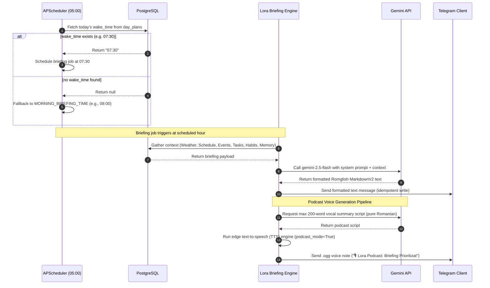
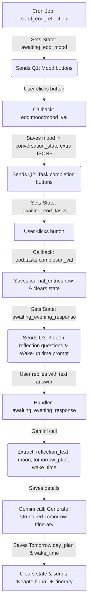

# Lora Reminders & Notifications Subsystem Reference

This document serves as the absolute technical manual for Lora's notification and reminder systems. It is optimized for both human engineers and AI chat agents/copilots to understand the triggers, database schemas, cron intervals, state machines, and dynamic generation pipelines of Lora's proactive assistant engine.

---

## 1. Core Architecture & Scheduling Engine

All notifications and reminders are orchestrated by the **APScheduler** (`AsyncIOScheduler`) in [scheduler/jobs.py](file:///Users/robudarius/Lora/scheduler/jobs.py). 

* **Timezone Context**: Triggers and cron times operate in the user's local timezone (configured via the `TIMEZONE` env variable, defaulting to `'Europe/Bucharest'` in the user profile).
* **Execution Boundary**: Initialized at bot startup inside `main.py` via `setup_scheduler(application, pool)`.
* **Idempotency Mechanism**: To prevent duplicate notifications during parallel ticks or bot hot-reloads, the system uses:
  1. Date-stamped idempotency flags directly in the `user_profile` table (e.g., `last_briefing_date`, `last_eod_date`).
  2. Dedicated transaction ledger tables to keep track of one-off sent events (e.g., `schedule_reminders_sent`, `event_day_reminders`).

> [!IMPORTANT]
> **Render Free Tier Keep-Alive / Health Check**:
> Render's Free Tier spins down the server container after 15 minutes of HTTP inactivity, which halts the `APScheduler` engine and stops all outgoing notification cron jobs.
> To prevent sleeping, `main.py` runs a background `aiohttp` web server bound to the Render-allocated port (using `os.environ.get("PORT")`).
> Configure your Render Dashboard's **Health Check Path** to `/health`. The bot serves a lightweight `200 OK` response at `/health` to keep the server awake and maintain continuous scheduler execution.

---

## 2. Database Schema Blueprint

The notifications subsystem relies on several PostgreSQL tables defined in [db/schema.sql](file:///Users/robudarius/Lora/db/schema.sql).

### Events & Alarms
```sql
CREATE TABLE IF NOT EXISTS events (
    id                     SERIAL PRIMARY KEY,
    title                  TEXT NOT NULL,
    description            TEXT,
    event_date             DATE NOT NULL,
    event_time             TIME,
    event_type             TEXT DEFAULT 'event' CHECK (event_type IN ('event', 'reminder')),
    project_id             INT REFERENCES projects(id) ON DELETE SET NULL,
    is_recurring           BOOLEAN DEFAULT FALSE,
    recurrence             TEXT CHECK (recurrence IN ('daily','weekly','monthly','yearly', NULL)),
    remind_before_minutes  INT DEFAULT 30,
    reminded_at            TIMESTAMPTZ,
    remind_1day            BOOLEAN DEFAULT FALSE,
    created_at             TIMESTAMPTZ DEFAULT NOW(),
    updated_at             TIMESTAMPTZ DEFAULT NOW()
);
```

### Idempotency Ledgers
```sql
-- Prevents duplicating day-before event alerts (sent at 20:00)
CREATE TABLE IF NOT EXISTS event_day_reminders (
    event_id    INT REFERENCES events(id) ON DELETE CASCADE,
    event_date  DATE,
    sent        BOOLEAN DEFAULT FALSE,
    PRIMARY KEY (event_id, event_date)
);

-- Prevents duplicating university class alerts (sent 15m before class)
CREATE TABLE IF NOT EXISTS schedule_reminders_sent (
    schedule_id     INTEGER REFERENCES schedule(id) ON DELETE CASCADE,
    reminder_date   DATE NOT NULL,
    sent_at         TIMESTAMP DEFAULT NOW(),
    PRIMARY KEY (schedule_id, reminder_date)
);
```

### Profile Idempotency Columns
The `user_profile` table tracks daily/weekly/monthly routines to guarantee exactly-once delivery:
* `last_briefing_date` (DATE) — Blocks duplicate Morning Briefings.
* `last_eod_date` (DATE) — Blocks duplicate EOD mood checks.
* `last_journal_date` (DATE) — Blocks duplicate journaling flows.
* `last_weekly_date` / `last_weekly_review_date` (DATE) — Blocks duplicate Weekly Reviews.
* `last_monthly_review_date` (DATE) — Blocks duplicate Monthly Reviews.
* `last_finance_summary_date` (DATE) — Blocks duplicate Weekly Finance Summaries.

---

## 3. Alarm Reminders (Cron & Interval Driven)

The scheduler checks and dispatches notification alerts via periodic cron and interval jobs:

| Notification Job | Frequency / Time | Trigger Logic & Source Data | Inline Controls / Callbacks |
| :--- | :--- | :--- | :--- |
| **University Class Reminders**<br>`check_class_reminders` | Interval: `Every 5 minutes` | Scans classes starting in $\le 16$ minutes using [get_upcoming_classes](file:///Users/robudarius/Lora/db/queries/schedule.py). Skips execution if `is_vacation(pool)` is true. | `✅ Prezent` $\rightarrow$ `attendance:present:{id}`<br>`❌ Absent` $\rightarrow$ `attendance:absent:{id}` |
| **Short-term Event Reminders**<br>`check_event_reminders` | Interval: `Every 5 minutes` | Scans events due in exactly $\le 30$ minutes where `reminded_at IS NULL`. Marks `reminded_at` upon sending. | `👍 Ok` $\rightarrow$ `event:reminder:ack:{id}`<br>`📝 Note` $\rightarrow$ `event:note:{id}` |
| **Day-Before Event Reminders**<br>`check_event_day_reminders` | Cron: `Daily at 20:00` | Scans events scheduled for tomorrow. Writes to `event_day_reminders` to guarantee exactly-once alert. | `👍 Ok` $\rightarrow$ `event:day:ack:{id}` |
| **Habit Streaks Reminder**<br>`check_habit_reminders` | Cron: `Daily at 18:00`<br>*(or `HABIT_REMINDER_TIME`)* | Scans active habits scheduled for today which have *not* been logged today. Sends checklist of up to 5 items. | `✅ {Habit}` $\rightarrow$ `habit:done:{id}`<br>`📋 Vezi toate` $\rightarrow$ `list:habits` |
| **Task Deadline Reminder**<br>`check_task_deadline_reminders` | Cron: `Daily at 09:00` | Queries pending tasks due today or overdue. Highlights overdue items first in Romanian / Romglish. | `✅ Mark done` $\rightarrow$ `task:reminder:dismiss`<br>`📝 Note` $\rightarrow$ `view:pending:tasks` |
| **Budget Forecast Alerts**<br>`check_budget_forecast` | Cron: `Thursdays at 09:00` | Projects current-month spending. Sends warning if any category is forecasted to exceed 85% of its limit. | None |
| **Academic Proactive Warnings**<br>`check_proactive_insights` | Cron: `Daily at 09:00 / 09:30` | Checks if attendance rates at any university subject fall below the 70% minimum threshold. | None |
| **Severe Weather Alerts**<br>`check_weather_alerts_job` | Interval: `Every 3 hours` | Queries OpenWeather API based on the latest `latitude`/`longitude` in user's profile. | None |

---

## 4. State-Driven Interactive Workflows

Interactive workflows combine scheduled triggers, Telegram inline keyboards, database conversation states, and generative LLM pipelines to execute adaptive routines.

### Flow A: Dynamic Morning Briefing Sequence
Every morning, Lora dynamically adjusts her briefing schedule to align with the user's scheduled wake-up time.



### Flow B: EOD interactive journaling & Tomorrow Itinerary Flow
Triggered automatically at the configured EOD reflection time (e.g., `21:00`). This flow transitions through several sequential database states.



1. **Phase 1: Mood Evaluation**
   * Trigger: `send_eod_reflection` runs.
   * Action: Sends EOD opening question. Sets state to `"awaiting_eod_mood"`.
   * Callback buttons: `🚀 Productivă` (`eod:mood:great`), `😐 Medie` (`eod:mood:neutral`), `📉 Slabă` (`eod:mood:terrible`).
2. **Phase 2: Task Check**
   * Trigger: User clicks a mood button.
   * Action: [handle_eod_callback](file:///Users/robudarius/Lora/bot/handler.py#L2948-L2982) extracts `value` (e.g. `great`), updates `conversation_state.extra` with `{"eod_mood": value}`, updates the message, and prompts task completion.
   * Sets state to `"awaiting_eod_tasks"`.
   * Callback buttons: `✅ Da, toate` (`eod:tasks:all`), `🌗 Parțial` (`eod:tasks:partial`), `❌ Nu` (`eod:tasks:none`).
3. **Phase 3: Text Journaling & Wake-up Setup**
   * Trigger: User clicks a task completion button.
   * Action: [handle_eod_callback](file:///Users/robudarius/Lora/bot/handler.py#L2983-L3037) extracts task completion status, queries the saved mood from `conversation_state.extra`, inserts the daily report into `journal_entries`, sets `last_eod_date` in the profile to mark completion, and clears the active state.
   * It then prompts the user with 3 open-ended journaling questions:
     1. *Ce a mers bine azi?*
     2. *Ce ai vrea să faci diferit?*
     3. *Cum vrei să arate ziua de mâine?*
     4. 📌 *La ce oră te trezești mâine? (ex: la 7, pe la 8:30)*
   * Sets state to `"awaiting_evening_response"`.
4. **Phase 4: Extraction & Itinerary Building**
   * Trigger: User sends their text reply.
   * Action: [awaiting_evening_response handler](file:///Users/robudarius/Lora/bot/handler.py#L1403-L1494) triggers:
     1. Calls Gemini with an extraction instruction to pull:
        * `reflection_text` (synthesized summary)
        * `mood` (sentimental analysis of text)
        * `tomorrow_plan` (what the user wants tomorrow to look like)
        * `wake_time` (standardized to `HH:MM`, e.g., `07:30`).
     2. Saves these findings to the database `journal_entries`.
     3. Calls Gemini to construct a structured hour-by-hour itinerary based on `tomorrow_plan`, pending tasks, calendar events, and `wake_time`.
     4. Saves the itinerary and `wake_time` into the `day_plans` table for tomorrow's date.
     5. Clears the conversation state, sets `last_journal_date = today`, and responds with `"✅ Jurnal salvat."`, tomorrow's itinerary, and a `"Noapte bună! 🌙"` signature.

---

## 5. Periodic Summaries & Audio Podcasts

Lora aggregates trends at scheduled milestones, generating both detailed Markdown text and rich vocal summaries:

### Weekly Summary
* **Weekly Finance Summary**: Runs every **Monday morning (5 minutes before the Morning Briefing)**. Aggregates the previous week's daily transactions using [get_weekly_finance_summary](file:///Users/robudarius/Lora/db/queries/finance.py). Lists top categories with spent amounts, total weekly spend, and remaining monthly budget limits. Protected by `last_finance_summary_date`.
* **Weekly Review**: Runs every **Sunday evening at 21:30**. Compiles completed tasks, habits completed, daily moods, sleep, water, and goals for the past week. Sends a clean review report and runs the TTS podcast generator to produce a voice note weekly brief. Protected by `last_weekly_review_date`.

### Monthly Summary
* **Monthly Review**: Runs on the **1st of every month at 20:00**. Performs high-level aggregations on task completion rates, top consistent habits, financial outlines, sleep quality, and health trends for the entire past month. Uses Gemini to compose a structured Romglish report and triggers the voice podcast pipeline to deliver a vocal review summarizing the month. Protected by `last_monthly_review_date`.

---

## 6. Guidelines for AI Agents Working on this System

When modifying or debugging the reminders and notifications system, always follow these rules:

1. **Do Not Send Direct Telegram Messages in Modules**: Never invoke Telegram API calls (like `send_message` or `send_voice`) inside operational modules. Always return `(reply_text, keyboard_or_none)` to let the router handlers safely dispatch them. The only exceptions are the scheduled jobs in [scheduler/jobs.py](file:///Users/robudarius/Lora/scheduler/jobs.py) which must compile and dispatch completed blocks.
2. **Always Use MarkdownV2 Safely**: Ensure that raw user inputs or unescaped variables (such as dates, projects, titles) are filtered using `escape_md()` from [bot/formatter.py](file:///Users/robudarius/Lora/bot/formatter.py) before embedding them in strings parsed with `ParseMode.MARKDOWN_V2`. Failure to do so will cause the Telegram API to reject the message due to unescaped formatting characters.
3. **Protect Idempotency Leggers**: If adding a new notification type, always create a corresponding `last_xxx_date` column in `user_profile` or a dedicated ledger table to ensure the alert is strictly idempotent.
4. **Never Short-circuit Wake Time Extraction**: The morning briefing schedule relies completely on `day_plans.wake_time` saved during EOD Phase 4. If modifying EOD journaling parsing, make sure the extracted wake-up hour remains compatible with standard standardizing routines (e.g. converting Romanian phrases like `"pe la 8 jumate"` to `"08:30"`).
